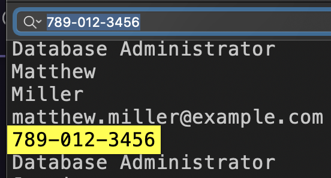
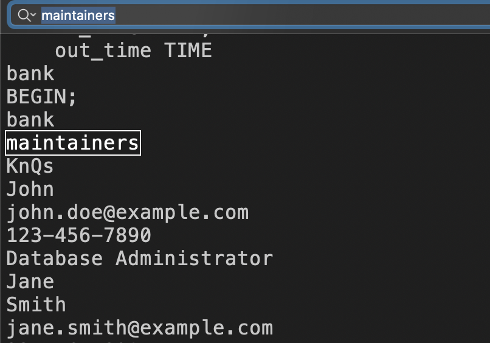
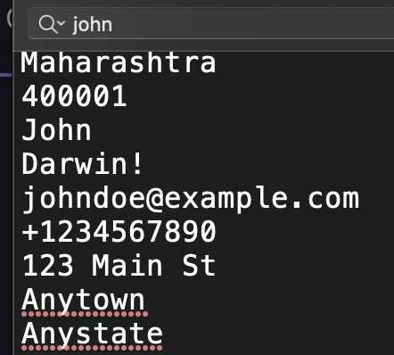
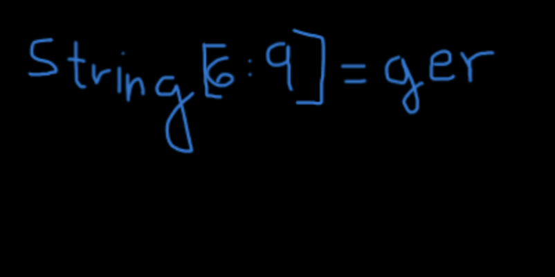
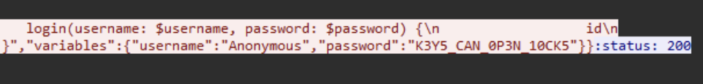
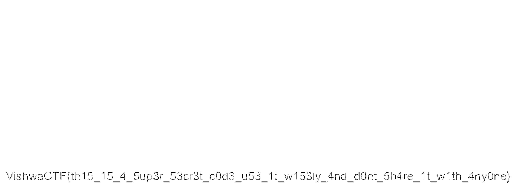

# Forensics Category:

### Smoke out the Rat challenge :

# Description :

> There was a major heist at the local bank. Initial findings suggest that an intruder from within the bank, specifically someone from the bank's database maintenance team, aided in the robbery. This traitor granted access to an outsider, who orchestrated the generation of fake transactions and the depletion of our valuable customers' accounts. We have the phone number, '789-012-3456', from which the login was detected, which manipulated the bank's employee data. Additionally, it's noteworthy that this intruder attempted to add gibberish to the binlog and ultimately dropped the entire database at the end of the heist.

> Your task is to identify the first name of the traitor, the last name of the outsider, and the time at which the outsider was added to the database.

> Flag format : VishwaCTF{TraitorFirstName_OutsiderLastName_HH:MM:SS}

We received the DBlog-bin.000007 file as an attachment.

To retrieve the information, we used the strings command on the file, which provided us with the bank's database.

The challenge description instructed us to find the first name of the traitor with the phone number 789-012-3456.

Through a simple search, we identified the traitor as Matthew Williams.



Now, moving on to the outsider who is part of the maintenance team:

Within the database, we found a table of maintainers containing only one person, named John.



To proceed, we need to determine John's last name, so we performed a search for his name.



for timestamp you must convert it to IST (Indian Standard Time).

FLAG : 
> VishwaCTF{Matthew_Darwin_15:31:29}

---------------------------

### Repo Riddles challenge :

# Description :

> We got a suspicious Linkedin post which got a description and also a zip file with it. It is suspected that a message is hidden in there. Can you find it?

>LinkedIn Post Description:

>Title: My First Project -The Journey Begins

>Hello fellow developers and curious minds!

>I'm thrilled to share with you my very first Git project - a labor of love, dedication, and countless late-night commits. 🚀

>Explore the code, unearth its nuances, and let me know your thoughts. Your feedback is invaluable and will contribute to the ongoing evolution of this project.


We had an attachment containing a zip file. Upon extracting the zip file, I executed the command "ls -a" and found a directory named ".git". To explore further, I used the command "git reflogs" to inspect the commit history.

While browsing through the commit history, I stumbled upon a text file containing flag characters and their corresponding indices. Additionally, within the commit history, there was a commit that has a Spotify web page and in its source code we have another flag characters. Furthermore, an image was also discovered in the commit history.

By combining these findings , I was able to get the flag.

string[9] = _
string[10] = 2
string[11] = 7
string[12] = 2
string[13] = 7

string[3: 6] = G1g

string[0] = G string[1] = 1 string[2] = t




Flag:
> VishwaCTF{G1t_G1gger_2727}

---------------------------

### Router |port| challenge :

# Description :

> There's some unusual traffic on the daytime port, but it isn't related to date or time requests. Analyze the packet capture to retrieve the flag


We were provided with a pcap capture file and instructed to examine the daytime port. Upon analysis, we discovered a text that appeared to be encrypted with ROT13.

After extracting all the encrypted texts and decrypting them using the ROT13 cipher, we were able to reconstruct a complete conversation. This likely contained valuable information relevant to the challenge or investigation at hand.

>Hey, mate!
>Yo, long time no see!
>You sure this mode of communication is still safe?
>Yeah, unless someone else is capturing network packets on the same network we're using. Anyhow, our text is encrypted, and it would be difficult to interpret.
>So let's hope no one else is capturing.
>What's so confidential that you're about to share?
>It's about cracking the password of a person with the username 'Anonymous.'
>Oh wait! Don't you know I'm not so good at password cracking?
>Yeah, I know, but it's not about cracking. It's about the analysis of packets. I've completed most of the job, even figured out a way to get the session key to decrypt and decompress the packets.
>Holy cow! How in the world did you manage to get this key from his device?
>Firstly, I hacked the router of our institute and closely monitored the traffic, waiting for 'Anonymous' to download some software that requires admin privilege to install. Once he started the download, I, with complete control of the router, replaced the incoming packets with the ones I created containing malicious scripts, and thus gained a backdoor access to his device. The further job was a piece of cake.
>Whoa! It's so surprising to see how much you know about networking or hacking, to be specific.
>Yeah, I did a lot of research on that. Now, should we focus on the purpose of this meet?
>Yes, of course. So, what should I do for you?
>Have you started the packet capture as I told you earlier?
>Yes, I did.
>Great! I will be sending his SSL key, so find the password of 'Anonymous.'
>Yes, I would, but I need some details like where to start.
>The only details I have are he uses the same password for every website, and he just went on to register for a CTF event.
>Okay, I will search for it.
>Wait a second, I won't be sending the SSL key on this Daytime Protocol port; we need to keep this untraceable.
>I will be sending it through FTP. Since the file is too large, I will be sending it in two parts. Please remember to merge them before using it. Additionally, some changes may be made to it during transfer due to the method I'm using. Ensure that you handle these issues.
>Okay! ...

After exporting the SSL keys from the ftp-data and discovering that they were encrypted with ROT20, we decrypted the SSL data. Upon importing the decrypted SSL data back into the pcap file, we were able to decrypt all the traffic within the pcap.

Given that we knew the username was "Anonymous", we conducted a simple string search within the decrypted traffic to find the corresponding password. Eventually, we found a password which turned out to be the flag we were seeking.



FLAG : 
> VishwaCTF{K3Y5_CAN_0P3N_10CK5}

---------------------------

### Mysterious Old Case challenge :

# Description :

> You as a FBI Agent, are working on a old case involving a ransom of $200,000. After some digging you recovered an audio recording.

In this challenge, we have an MP3 file. While listening to it, we hear someone talking in reverse in the middle of the song. After reversing that part, we hear the following message:

```
I sm John Cooper. It is 24th of November, 1971. Now I have left from Seattle and headed towards Reno. I've got all my demands fulfilled. I have done some changes in the flight log and uploaded it to a remote server. The file is encrypted. The hint for decryption is the airliner that I was flying in. Most importantly, the secret key is split and hidden in every element of the Fibonacci series starting from two.
```

In the EXIF metadata of the MP3 file, we have a link to a drive containing many flight logs and a hint for the password to access the flight log:

```
Comment                         : password for the zip is all lowecase with no spaces
User Defined URL                : https://drive.google.com/file/d/1bkuZRLKOGWB7tLNBseWL34BoyI379QbF/view?usp=drive_lin
```

Since this case is related to D.B. Cooper (a famous plane hijack), we know that the flight log is for Flight 305, and the password is the name of the airliner he was flying during the hijack.

password : northwestorientairlines

therefore the flight log looks like this:

```
1971-11-24 06:22:08.531691 - ATT - Boeing 727
V
i
1971-11-24 07:31:08.531691 - HWR - Boeing 727
s
1971-11-24 06:22:08.531691 - ATT - Boeing 727
1971-11-24 07:31:08.531691 - HWR - Boeing 727
h
1971-11-24 06:22:08.531691 - ATT - Boeing 727
1971-11-24 06:22:08.531691 - ATT - Boeing 727
1971-11-24 06:22:08.531691 - ATT - Boeing 727
1971-11-24 07:31:08.531691 - HWR - Boeing 727
w
1971-11-24 07:31:08.531691 - HWR - Boeing 727
1971-11-24 06:22:08.531691 - ATT - Boeing 727
1971-11-24 06:22:08.531691 - ATT - Boeing 727
1971-11-24 07:31:08.531691 - HWR - Boeing 727
1971-11-24 07:31:08.531691 - HWR - Boeing 727
1971-11-24 07:31:08.531691 - HWR - Boeing 727
1971-11-24 06:22:08.531691 - ATT - Boeing 727
a
...
```
So I applied a Python script to extract the characters from the file, since they are in a Fibonacci sequence.

FLAG : 
> VishwaCTF{1_W!LL_3E_B@CK}

---------------------------

### Secret Code challenge :

# Description :

> Akshay has a letter for you and need your help

In this challenge, we have two attachments: a TXT file and a black picture.

Applying binwalk to the picture revealed a ZIP file containing another ZIP file, which was protected. There was also a text file stating that the password for the ZIP is a 6-digit number.

After cracking the ZIP with John using a wordlist containing all 6-digit combinations:

```
$ zip2john 5ecr3t_c0de.zip > hash
$ john --wordlist=wordlist.txt hash
```

The code was found to be 945621.

Upon extracting the ZIP, we obtained another two TXT files. One of them resembles:

```
(443, 1096)
(444, 1096)
(445, 1096)
(3220, 1096)
(3221, 1096)
(38, 1097)
(39, 1097)
(43, 1097)
(80, 1097)
(81, 1097)
(83, 1097)
(93, 1097)
(95, 1097)
...
```

And the other file suggests that these numbers might be related to the earlier image.

those are pixel cooredination so i made a pyhton script to put in those coordinations a black dot

```py
from PIL import Image, ImageDraw

def draw_points_on_blank_image(coordinates):
    width = max(coord[0] for coord in coordinates) + 10
    height = max(coord[1] for coord in coordinates) + 10

    img = Image.new("RGB", (width, height), color="white")
    draw = ImageDraw.Draw(img)

    for coord in coordinates:
        draw.point(coord, fill="black")

    img.save("image_with_points.jpg")

coordinates = [
(443, 1096),
(444, 1096),
(445, 1096),
(3220, 1096),
(3221, 1096),
(38, 1097),
(39, 1097),
(43, 1097),
(80, 1097),
(81, 1097),
(83, 1097),
(93, 1097),
...
(3221, 1166),
(3222, 1166)
]

draw_points_on_blank_image(coordinates)

print("Image created 'image_final.jpg'")

```



FLAG : 
> VishwaCTF{th15_15_4_5up3r_53cr3t_c0d3_u53_1t_w153ly_4nd_d0nt_5h4re_1t_w1th_4ny0ne}

---------------------------
# Reverse Engineering Category:

### Your Bonus challenge :

# Description :

> I am very kind, and you're my friend too. I was about to share some flags with you, but unfortunately, a ransomware attack occurred on the file containing those flags. All the flags got encrypted by the ransomware. After cross-checking the directories, I found the ransomware file and some other related items.

> I'm going to share that information with you. However, due to the ransomware, I'm unable to provide you with the flags 😥😥. Now, I need your help to recover those flags. Can you assist me, please? Your cooperation would be highly appreciated, and you will receive a reward for your help.

> Note : Ransomware are not meant to be executed as it can harm your systems (although this won't) 

In this challenge, we received a ransomware.exe file and two text files. One of them contained some random characters.

Then, opening the executable file in Ghidra and jumping to the main function to see how it works.

We observe that the application opens a file named "Flags.txt" and writes to it.

So, we used a Python script to reverse the random characters in the "Your_hacked_data0.txt" file, as it's the output of the flag.

```py
# Define the symbols used for encoding
symbols = ['#','(','&','*',')','!','%','$','@','^']

# Read data from the file and strip whitespace
with open('Your_hacked_data0.txt', 'r') as file:
    lines = [line.strip() for line in file]

# Function to convert symbols to decimal numbers
def symbols_to_decimal(line):
    decimal_line = ""
    for char in line:
        if char in symbols:
            decimal_line += str(symbols.index(char))
    return decimal_line

# Function to convert decimal numbers to ASCII and search for the flag (format: VISHWACTF)
def decimal_to_ascii(decimal_string):
    for offset in range(50):
        ascii_string = ""
        for i in range(0, len(decimal_string), 2):
            num = int(decimal_string[i:i+2]) + offset
            ascii_string += chr(num)
        if "VISHWACTF" in ascii_string:
            print(ascii_string)

# Process each line in the file
for line in lines:
    decimal_line = symbols_to_decimal(line)
    decimal_to_ascii(decimal_line)
```

FLAG : 

> VISHWACTF{4R3_R4N50MW4R35_B3AUTIFUL}