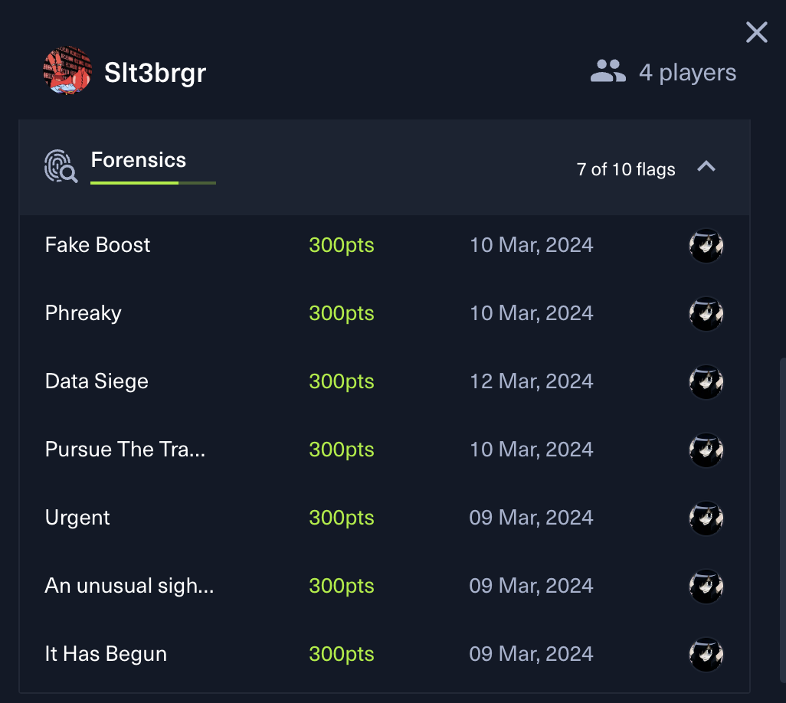
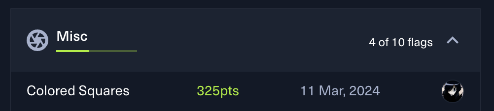
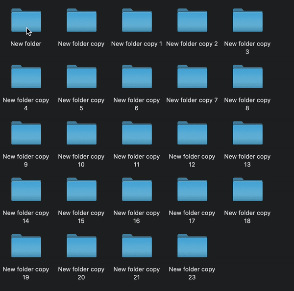
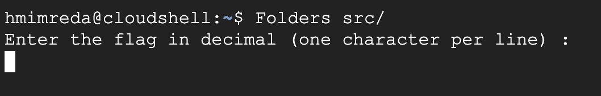

i played Hack The Box Cyber Apocalypse 2024: Hacker Royale CTF and really enjoyed it

we were 4 players on the team Stl3brgr we managed to get the 308th Rank

i solved 7 out of 10 Forensics Challenges, with some other challs in Reverse, Misc category



i will not write all the forensics challenges solutions since there are many write ups of them online

but i will only write the `Colored Squares` challnege since it has less solves (23 solves i guess)



### Colored Squares challenge :

In this challenge, we have an attachment that is a zip file containing a folder. Inside this folder, there are many subfolders, each containing further subfolders. In total, there are 2727 folders, and all of them are empty.



After a quick search, I found that there is an esoteric programming language which encodes the program entirely into the directory structure called [Folders](https://esolangs.org/wiki/Folders).

After installing it using pip:

`pip install Folders`

To execute the program, you need to run:

`Folders <main folder>`

We got the program running, asking us to input the flag character by character in decimal.



and to see the program code in python you need to use the option `-l`

`Folders -l src/`

and the program code is:

```py
print("Enter the flag in decimal (one character per line) :\n", end='', flush=True)
var_0 = input()
if var_0.isdigit():
    var_0 = int(var_0)
else:
    var_0 = var_0
var_1 = input()
if var_1.isdigit():
    var_1 = int(var_1)
else:
    var_1 = var_1
[...]
var_21 = input()
if var_21.isdigit():
    var_21 = int(var_21)
else:
    var_21 = var_21
if (((var_7) - (var_18)) == ((var_8) - (var_9))):
    if (((var_6) + (var_10)) == (((var_16) + (var_20)) + (12))):
        if (((var_8) * (var_14)) == (((var_13) * (var_18)) * (2))):
            if ((var_19) == (var_6)):
                if (((var_9) + (1)) == ((var_17) - (1))):
                    if (((var_11) / ((var_5) + (7))) == (2)):
                        if (((var_5) + ((var_2) / (2))) == (var_1)):
                            if (((var_16) - (9)) == ((var_13) + (4))):
                                if (((var_12) / (3)) == (17)):
                                    if ((((var_4) - (var_5)) + (var_12)) == ((var_14) + (20))):
                                        if ((((var_12) * (var_15)) / (var_14)) == (24)):
                                            if ((var_18) == ((173) - (var_4))):
                                                if ((var_6) == ((63) + (var_5))):
                                                    if (((32) * (var_16)) == ((var_7) * (var_0))):
                                                        if ((125) == (var_21)):
                                                            if (((var_3) - (var_2)) == (57)):
                                                                if (((var_17) - (var_15)) == ((var_18) + (1))):
                                                                    print("Good job! :)", end='', flush=True)
```

The program prompts the user to enter a flag in decimal and then checks if the entered values satisfy a series of conditions. 
To obtain the flag, we need to reverse it. 
Since the flag format is HTB{}, I replaced the known variables with their values.
And after that we only got some characters.
`HTB{ 3r    t3      r }`

```py
if (((var_7) - (var_18)) == ((var_8) - (var_9))):
    if (((114) + (var_10)) == (((var_16) + (var_20)) + (12))):
        if (((var_8) * (var_14)) == (((var_13) * (var_18)) * (2))):
                if (((var_9) + (1)) == ((var_17) - (1))):
                            if (((var_16) - (9)) == ((var_13) + (4))):
                                    if ((((var_4) - (51)) + (51)) == ((var_14) + (20))):
                                        if ((((51) * (var_15)) / (var_14)) == (24)):
                                            if ((var_18) == ((173) - (var_4))):
                                                    if (((32) * (var_16)) == ((var_7) * (72))):
                                                                if (((var_17) - (var_15)) == ((var_18) + (1))):
                                                                    print("Good job! :)", end='', flush=True)
```

Is it a dead end? NO.


There are two solutions:
The first involves guessing the position of the underscore and checking if the conditions are correct (not getting a decimal number or special characters).
Alternatively, there's the sick solution that I attempted, which is brute-forcing variables. Brute-forcing all the variables is possible but it would take a very long time, possibly until the CTF ends.
So, I only brute-forced three variables as an example, considering these conditions:

```py
 if ((((var_4) - (51)) + (51)) == ((var_14) + (20))):
    if ((((51) * (var_15)) / (var_14)) == (24)):
```

Each time my script gives me a value, I try to solve the equations.
Then, I noticed that the first variable, var_4, is z, var_14 is f, and var_15 is 0.
It occurred to me that maybe the first word is "zero" (z3r0) and the last word is "folders" (f0ld3rs). Finally, I got the full flag.

FLAG : 
> HTB{z3r0_byt3_f0ld3rs}