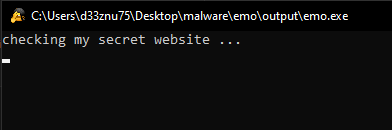
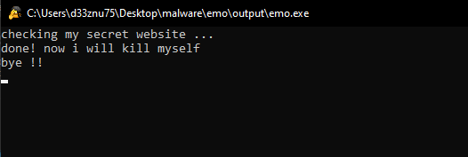
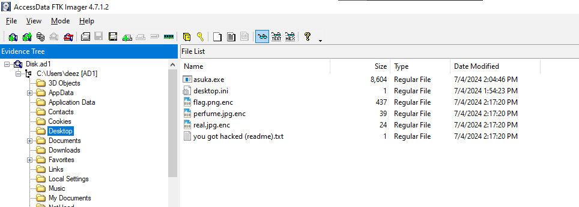
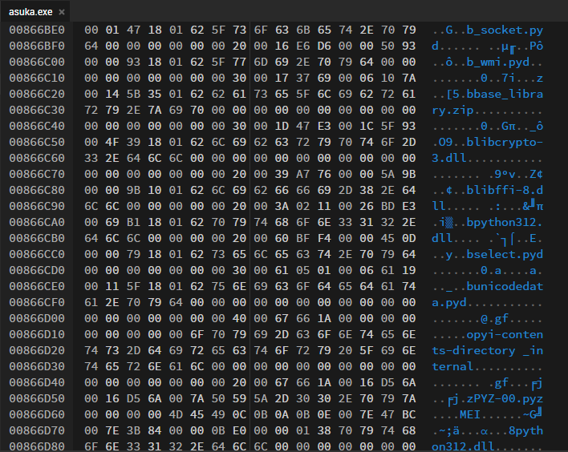
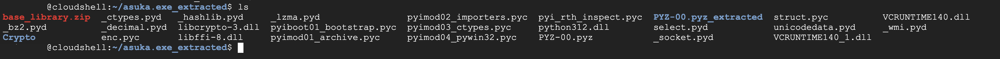
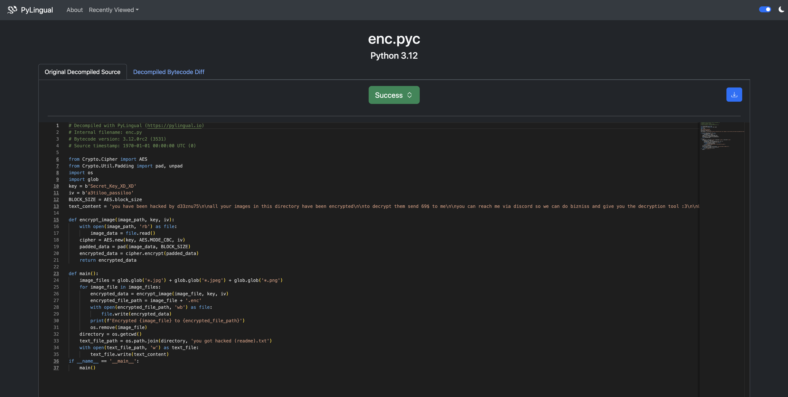

# Forensics Category:

### emo

# Description :

> This app does something and then kills himself. Check what it does.

> Author : d33znu75

> Attachment : [emo.exe](https://www.mediafire.com/file/a12zrdyoz5323ye/emo.exe/file)

In this challenge, we have an executable. If we run it in a sandbox, we see a message in the terminal that says "checking my secret website," then after a few seconds, it says "done! now I will kill myself."





So, the program checks a website and performs some action with it (ping, request, etc.).

We can use Wireshark to see network logs, but there is an easier way.

Let's upload it to VirusTotal and check its behavior.

VirusTotal helps us by analyzing programs through sandboxes and provides us with reports.


We see this website: 'cutmylifeintopieces.000webhostapp.com'

Visiting it, we see a 'Get Flag' button that gives us the flag.


FLAG : 
> AKASEC{v333ry_b4s1c_m4lw4r3_4n4lys1s_:3}

### Ransomware :

# Description :

> My friend downloaded an app (asuka.exe), but it turned out to be ransomware that encrypted all his images on the desktop. Can you help him recover them?

> !!! PLEASE NOTE: THIS IS RANSOMWARE. DO NOT RUN IT NEAR YOUR IMAGES. Keep it safe, and if you need to test it, run it in an isolated folder with non-important images.

> Author : d33znu75

> Attachment : [Disk.ad1](https://www.mediafire.com/file/hhg8qopilzauwdi/Disk.ad1/file)

In this challenge, we have a .ad1 disk image, so let's open it with FTK Imager. The challenge description says that the encrypted files and the ransomware are on the desktop.



We have the ransomware (asuka.exe) and the encrypted flag (flag.png.enc), so let's export them.

You will not need to execute the ransomware; instead, let's analyze it.

Let's start with basic analysis by running the file command on the executable and checking the hexdump.




We discovered that it is a PE32+ executable, and we noticed some '.pyd' files. A PYD file, also known as a Python Dynamic Module, is a compiled Python extension module with the .pyd extension.

Since the program is coded in Python, let's reverse it by first using the [pyinstxtractor.py](https://github.com/extremecoders-re/pyinstxtractor/blob/master/pyinstxtractor.py) script.

PyInstaller Extractor is a Python script to extract the contents of a PyInstaller-generated executable file.


We got the 'Possible entry point: enc.pyc,' which means that this is the main code.

PYC files are compiled bytecode files that are generated by the Python interpreter when a Python script is imported or executed.

Pyinstxtractor drops the .pyc files of the program in the {name of the program}_extracted folder.



Now let's decompile enc.pyc using an online tool like [pylingual](https://pylingual.io/)



we see that the ransomware do the AES encryption to the images we see the key and the IV so lets decrypt the image

```py
from Crypto.Cipher import AES
from Crypto.Util.Padding import unpad
import os
import glob

key = b'Secret_Key_XD_XD'
iv = b'a3tiloo_passiloo'
BLOCK_SIZE = AES.block_size

def decrypt_image(encrypted_image_path, key, iv):
    with open(encrypted_image_path, 'rb') as file:
        encrypted_data = file.read()
    cipher = AES.new(key, AES.MODE_CBC, iv)
    decrypted_data = unpad(cipher.decrypt(encrypted_data), BLOCK_SIZE)
    return decrypted_data

def main():
    encrypted_image_files = glob.glob('*.enc')
    for encrypted_image_file in encrypted_image_files:
        decrypted_data = decrypt_image(encrypted_image_file, key, iv)
        original_file_path = encrypted_image_file.replace('.enc', '')
        with open(original_file_path, 'wb') as file:
            file.write(decrypted_data)
        print(f'Decrypted {encrypted_image_file} to {original_file_path}')

if __name__ == '__main__':
    main()

```

et voila we got the original image UwU


FLAG : 
> AKASEC{Good_job_you_are_a_master_UwU}
